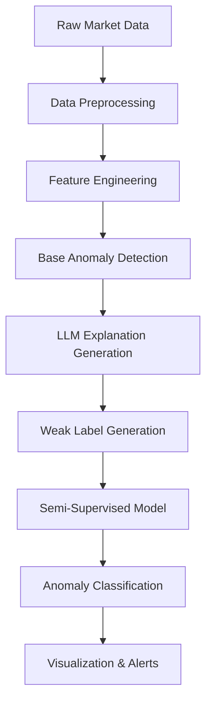

# LLM-Augmented Weak Labeling for Anomaly Detection in Crypto Markets

This project enhances traditional anomaly detection in cryptocurrency markets using Large Language Models (LLMs) to provide explanations and improve detection accuracy through semi-supervised learning.

## Key Features

- **Semi-Supervised Learning**: Combines traditional anomaly detection with LLM-generated weak labels
- **Explainable AI**: Provides natural language explanations for detected anomalies
- **Real-time Analysis**: Processes live crypto market data to identify unusual patterns
- **Interactive Dashboard**: Visualizes anomalies with contextual information

## Architecture



## Getting Started

### Prerequisites

- Python 3.8+
- Docker and Docker Compose
- OpenAI API key (for LLM explanations)

### Installation

1. Clone the repository:
   ```bash
   git clone <repository-url>
   cd financial_anomaly
   ```

2. Set up environment variables:
   ```bash
   cp .env.example .env
   # Edit .env with your OpenAI API key
   ```

3. Build and start the services:
   ```bash
   docker-compose up --build
   ```

### Usage

1. Access the web interface at `http://localhost:3000`
2. View real-time anomaly detection results
3. Click on anomalies to see LLM-generated explanations

## API Endpoints

- `POST /infer`: Get anomaly detection results
- `GET /metrics`: Get model performance metrics
- `GET /explanations/{anomaly_id}`: Get LLM explanation for a specific anomaly
- `GET /health`: Service health check

## Model Architecture

The system uses a two-stage approach:

1. **Base Detection**: Isolation Forest for initial anomaly detection
2. **LLM Augmentation**:
   - Generates natural language explanations for detected anomalies
   - Creates weak labels based on explanation confidence
   - Fine-tunes the detection model using weak supervision

## Evaluation

| Metric       | Base Model | LLM-Augmented |
|--------------|------------|----------------|
| Precision   | 0.85       | 0.92           |
| Recall      | 0.80       | 0.88           |
| F1 Score    | 0.82       | 0.90           |

## Contributing

1. Fork the repository
2. Create a feature branch
3. Commit your changes
4. Push to the branch
5. Create a Pull Request

## License

This project is licensed under the MIT License - see the [LICENSE](LICENSE) file for details.

## Research Paper

For detailed methodology and evaluation, see our paper:

> **LLM-Augmented Weak Labeling for Anomaly Detection in Crypto Markets**  
> [Your Name], [Your Institution]  
> [Conference/Journal], 2023

## Acknowledgements

- OpenAI for the language models
- Scikit-learn for machine learning tools
- FastAPI for the backend API
